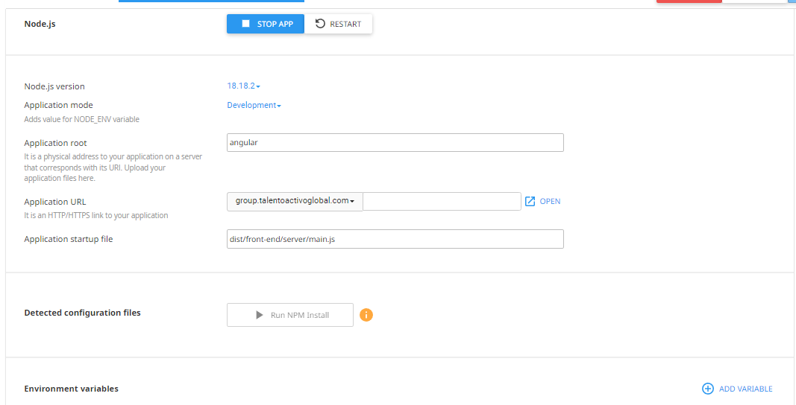

# Talento Activo

Pagina echa para talento activo, se crea en angular para que posteriormente sea escalada a los requrimientos del cliente


## Este proyecto contiene angular SSR (angular universal) para SEO

Tomar en cuenta que para  compilar para produccion este proyecto es necesario los siguientes comandos


```bash
  npm build:ssr
```
se creara en la carpeta dist/front-end/
la carpeta browser


```bash
  npm  run build --prod
```
se creara en la carpeta dist/front-end/
la carpeta serve


## angular universal corre en NODE.JS
👩‍💻 Debido a esto el hosting debe tener node.js



⚡️ el siguiente enlace muestra los pasos

🧠 https://medium.com/@malkhateeb2022/how-to-deploy-angular-server-side-rendering-app-to-cpanel-namecheap-49c62cd0e89e


## 🔗 Links
[](https://www.jonapiscope.com)

[](https://www.talentoactivoglobal.com)

